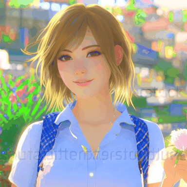
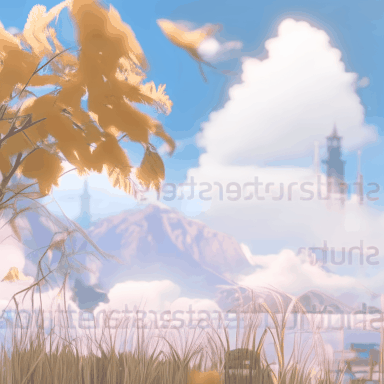
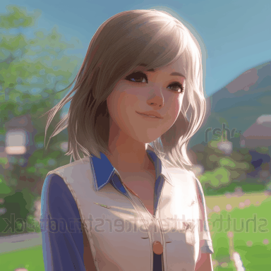

# Kandimate

This repository allows you generate short gifs with temporal extension for Kandinskiy-2-2 models.

Approach based on [AnimateDiff](https://github.com/guoyww/AnimateDiff) with [Kandinsky-2](https://github.com/ai-forever/Kandinsky-2) models and interpolation [FILM](https://github.com/dajes/frame-interpolation-pytorch/releases/tag/v1.0.0) models.

Examples:  

<table width="800" class="center">
    <tr>
    <td></td>
    <td></td>
    <td></td>
    <td></td>
    </tr>
</table>  

## Common Issues
`WARNING!` Current model version was trained on `3%` data from [WebVid](https://github.com/m-bain/webvid) dataset.  
So, it maybe difficult to get a good result.

GPU MEM requirements (RTX 3090 or 4090 at least):
- 512x512 generation ~ 17 GB
- 768x768 generation ~ 24 GB

PS.
Best image generation with 4 < guidance_scale < 8  and image_size = 768.

## Setups for Inference
### Prepare Environment

```bash
git clone https://github.com/TheDenk/Kandimate.git
cd Kandimate
```

Requirements with pip
```bash
pip install -r requiremetns.txt
```

Or with conda
```bash
conda env create -f environment.yaml
conda activate kandimate
```

### Download Base Models And Motion Module Checkpoints
```bash
git lfs install

git clone https://huggingface.co/kandinsky-community/kandinsky-2-2-decoder ./models/kandinsky-2-2-decoder

git clone https://huggingface.co/kandinsky-community/kandinsky-2-2-prior ./models/kandinsky-2-2-prior

bash download_bashscripts/download-motion-module.sh
bash download_bashscripts/download-interpolation-models.sh
```
You may also directly download the motion module and interpolation models checkpoints from [Google Drive](https://drive.google.com/drive/folders/1GYMJ6ZJMljikSPkbJQNIbORqtdJjHBD0?usp=sharing), then put them in `models/motion-modules/` folder and  `models/interpolation-models/` respectively.  

Interpolation models also can be foud [here](https://github.com/dajes/frame-interpolation-pytorch/releases/tag/v1.0.0).  

## Inference    
  
#### Main inference

All generation parameters, such as `prompt`, `negative_prompt`, `seed`, etc. stored in config file `configs/inference/inference.yaml`.   
After downloading the all models, run the following commands to generate animations.  

The results will automatically be saved to `samples/` folder.  

```bash
python -m scripts.animate --config ./configs/inference/inference.yaml
```
  
It is recommend users to generate animation with 16 frames and 768 resolution. Notably, various resolution/frames may affect the quality more or less.  
  
#### Interpolation (optional)

Also you can apply interpolation between frames to make gif more smoothness.
Set path to gif and inerpolation parameters in `./configs/interpolation/interpolation.yaml`.
  
```bash
python -m scripts.interpolate --config ./configs/interpolation/interpolation.yaml
```
  
## Steps for Training

### Dataset
Before training, download the videos files and the `.csv` annotations of [WebVid10M](https://maxbain.com/webvid-dataset/) to the local mechine.
Note that the training script requires all the videos to be saved in a single folder. You may change this by modifying `kandimate/data/dataset.py`.

### Configuration
After dataset preparations, update the below data paths in the config `.yaml` files in `configs/training/` folder:
```
train_data:
  csv_path:     [Replace with .csv Annotation File Path]
  video_folder: [Replace with Video Folder Path]
  sample_size:  256
```
Other training parameters (lr, epochs, validation settings, etc.) are also included in the config files.

### Training
To train motion modules
```
torchrun --nnodes=1 --nproc_per_node=1 train.py --config configs/training/training.yaml
```

## Gradio Demo
Gradio demo was created to make Kandimate easier to use. To launch the demo, please run the following commands:
```
conda activate kandimate
python app.py
```
By default, the demo will run at `localhost:7860`.
Be sure that imageio with backend is installed. (pip install imageio[ffmpeg])

## Todo
- [x] Add train and inference scripts (py and jupyter).
- [x] Add interpolation inference scripts (py and jupyter).
- [-] Add Gradio Demo.
- [-] Add controlnet (?probably). 

## Gallery
Here several best results.

<table width="800" class="center">
    <tr>
    <td></td>
    <td></td>
    <td></td>
    <td></td>
    </tr>
</table>  
<table width="800" class="center">
    <tr>
    <td></td>
    <td></td>
    <td></td>
    <td></td>
    </tr>
</table>  

## Acknowledgements
Codebase [AnimateDiff](https://github.com/guoyww/AnimateDiff) and [Tune-a-Video](https://github.com/showlab/Tune-A-Video).  
Diffusion models [Kandinsky-2](https://github.com/ai-forever/Kandinsky-2).  
Interpolation models [FILM](https://github.com/google-research/frame-interpolation) models.  

## Contacts
<p>Issues should be raised directly in the repository. For professional support and recommendations please <a>welcomedenk@gmail.com</a>.</p>